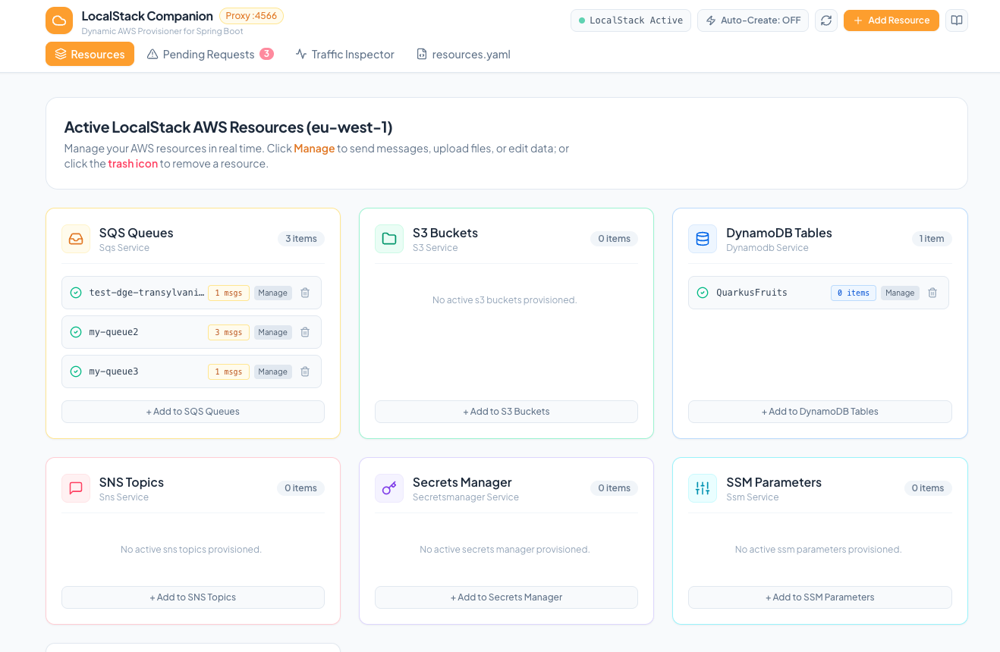
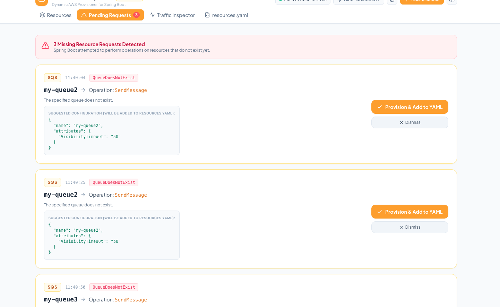
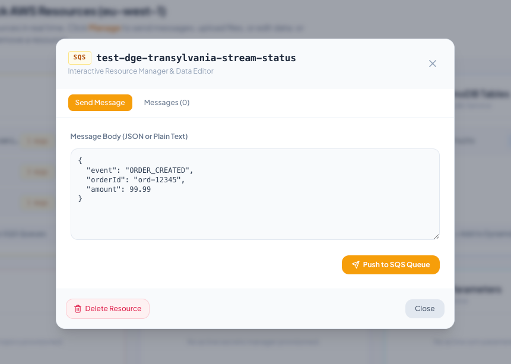

# LocalStack Companion Wiki

Welcome to the **LocalStack Companion** documentation and wiki. This guide provides an in-depth walkthrough of the purpose, architecture, visual interfaces, interactive resource tools, and configuration workflows of LocalStack Companion.

---

## 1. Purpose & Motivation

### The Challenge of Local Cloud Development
Developing cloud-native microservices with frameworks like **Spring Boot**, **Quarkus**, **Micronaut**, or Node.js against AWS services locally using [LocalStack](https://localstack.cloud/) is standard practice. However, local workflows typically suffer from several friction points:

1. **Manual Provisioning Boilerplate**: Developers often have to maintain brittle `init-aws.sh` shell scripts, Terraform setups, or custom CLI commands to bootstrap queues, buckets, and tables before their app can even start.
2. **Runtime Failures & Missing Resources**: When a developer adds a new `@SqsListener`, DynamoDB repository, or S3 client call, the application crashes or throws runtime errors (`QueueDoesNotExist`, `NoSuchBucket`, `ResourceNotFoundException`) if the resource was not pre-created.
3. **Lack of Visibility**: Inspecting what messages are inside a local SQS queue, viewing uploaded S3 files, or checking DynamoDB records usually requires running verbose `awslocal` CLI commands.
4. **Disjointed State**: Manual modifications made inside LocalStack are ephemeral and vanish on container restart unless manually codified back into infrastructure files.

### The Solution: LocalStack Companion
**LocalStack Companion** is an intelligent reverse proxy, declarative provisioner, and real-time Web UI designed to sit seamlessly in front of LocalStack. It turns local AWS development into an interactive, self-healing, and observable experience.

```
                                  +-----------------------------------------------+
                                  |      LocalStack Resource Companion (:4566)    |
+---------------------------+     |                                               |     +----------------------+
|                           |     |  +--------------------+  +-----------------+  |     |                      |
| Spring Boot / Cloud Apps  |====>|  | Smart Proxy &      |  | FastAPI REST    |  |====>| LocalStack Core      |
| (aws.endpoint: :4566)     |     |  | Error Interceptor  |  | & WebSockets    |  |     | (internal port :4567)|
|                           |     |  +--------------------+  +-----------------+  |     |                      |
+---------------------------+     |            |                      |           |     +----------------------+
                                  |            v                      v           |
                                  |   [resources.yaml]        [React Web UI]      |
                                  +-----------------------------------------------+
```

---

## 2. Core Architecture & How It Works

LocalStack Companion exposes port `4566` (the standard AWS endpoint port). When your application communicates with LocalStack:

1. **Transparent Proxying**: Requests destined for AWS services (S3, SQS, SNS, DynamoDB, Secrets Manager, SSM, KMS) pass directly through Companion's smart proxy to LocalStack Core.
2. **Error Interception & Detection**: If LocalStack returns a 404 or `ResourceNotFoundException` (such as a missing queue or table), Companion intercepts the error payload, identifies the missing resource, and surfaces it to the Web UI in real time.
3. **Declarative Synchronization**: A single `resources.yaml` file defines your local environment's baseline. When LocalStack starts, Companion ensures all declared resources exist. When you provision or edit resources through the UI, Companion updates `resources.yaml` automatically.
4. **Real-time Reactive UI**: Built with React, Tailwind CSS, and WebSockets, changes in resources, pending requests, and traffic logs are broadcast and updated immediately without manual page refreshes.

---

## 3. Visual Tour & Interface Walkthrough

### 3.1. Main Dashboard: Active AWS Resources

The main dashboard gives you an instant, unified view of all provisioned cloud resources across multiple AWS services in your configured region (`eu-west-1`):



#### Highlights:
* **Real-Time Resource Cards**: Visual cards categorize your resources across **SQS Queues**, **S3 Buckets**, **DynamoDB Tables**, **SNS Topics**, **Secrets Manager**, and **SSM Parameters**.
* **Live Status & Counters**: Each item displays live status badges and counters (e.g. `1 msgs`, `3 msgs` in SQS queues, or `0 items` in DynamoDB tables).
* **Direct Management**:
  * **Manage**: Opens the [Interactive Resource Manager](#33-interactive-resource-manager--data-editor) to push test messages, inspect files, or edit database items.
  * **Delete (Trash Icon)**: Removes the resource from LocalStack and optionally prunes it from `resources.yaml`.
  * **+ Add to Service**: Fast manual creation modal for any AWS service without writing code.
* **Top Navigation & Controls**:
  * **LocalStack Active Badge**: Real-time heartbeat indicator confirming LocalStack engine health.
  * **Auto-Create Toggle**: Switch between interactive review mode and automatic self-healing.
  * **Quick Refresh & Documentation**: Instant sync trigger and quick reference modals.

---

### 3.2. Pending Requests & 1-Click Provisioning

When a microservice (e.g. Spring Boot) makes an AWS SDK call to a resource that hasn't been created yet, LocalStack Companion intercepts the error and presents an actionable prompt:



#### How It Operates:
1. **Error Detection**: In the screenshot above, a Spring Boot app attempted a `SendMessage` operation on `my-queue2` and `my-queue3`, triggering `QueueDoesNotExist` (400).
2. **Alert Notification**: A prominent alert banner highlights `3 Missing Resource Requests Detected` with the exact timestamp and target operation.
3. **Suggested Configuration Preview**: Companion automatically synthesizes the appropriate JSON specification (e.g., Visibility Timeout, Retention, Partition Keys).
4. **1-Click Actions**:
   * **Provision & Add to YAML**: Immediately creates the resource inside LocalStack and appends it to `resources.yaml`.
   * **Dismiss**: Clears the notification if the request was unexpected or a transient error.
5. **Zero App Restarts**: As soon as you click **Provision & Add to YAML**, re-running the failed API call from your microservice succeeds immediately!

> [!TIP]
> **Auto-Create Mode**: When enabled (`Auto-Create: ON` in the top bar), Companion bypasses the pending prompt and immediately provisions the missing resource behind the scenes, ensuring microservices start up without interruption.

---

### 3.3. Interactive Resource Manager & Data Editor

Clicking **Manage** on any resource card launches the **Interactive Resource Manager** modal for direct data inspection and manual event triggering.



#### Capabilities by Service:

#### 📬 SQS Queues
* **Send Message**: Compose structured JSON or plain text payloads and push them directly to the queue with the **"Push to SQS Queue"** button.
* **Messages Tab**: Peek at in-flight or waiting messages, inspect Message IDs, and read payloads.
* **Purge Queue**: Clear accumulated test messages with a single click.

#### 🪣 S3 Buckets
* **File Upload**: Upload JSON, text, or binary files with specified object keys.
* **Object Browser**: List all stored objects with file sizes.
* **Inline Preview**: Inspect and read file contents directly in the modal.
* **Object Deletion**: Remove individual objects cleanly.

#### 🗄️ DynamoDB Tables
* **Item Scanner**: Scan and view current table records in formatted JSON.
* **Insert Item**: Inject new records into the table with schema validation.

#### 🔐 Secrets Manager & ⚙️ SSM Parameters
* **Live Value Editor**: View and update secret strings or parameter values.
* **Reveal/Hide Toggle**: Mask sensitive secrets while screen-sharing or presenting.
* **Automatic Config Sync**: Edits are persisted directly into `resources.yaml`.

#### 📢 SNS Topics
* **Publish Events**: Broadcast test events to topics to trigger connected SQS subscriptions or downstream workers.

---

### 3.4. Traffic Inspector

The **Traffic Inspector** tab provides a live streaming feed of all AWS API requests executed against the proxy:
* **Service & Action**: Identifies `sqs:SendMessage`, `s3:PutObject`, `dynamodb:GetItem`, `secretsmanager:GetSecretValue`, etc.
* **Resource Identifier**: Shows the exact bucket, queue, or table targeted.
* **Status & Latency**: Shows HTTP status codes (200, 400, 404, 500) and response times in milliseconds.
* **Payload Inspection**: View headers and raw request bodies for rapid debugging.

---

### 3.5. Live YAML Configuration (`resources.yaml`)

The **resources.yaml** tab in the UI embeds a live editor for your declarative configuration:

```yaml
version: "1.0"

services:
  s3:
    buckets:
      - name: app-uploads-bucket
        acl: private

  sqs:
    queues:
      - name: test-dge-transylvania-stream-status
        attributes:
          VisibilityTimeout: "30"
      - name: my-queue2
        attributes:
          VisibilityTimeout: "30"
      - name: my-queue3
        attributes:
          VisibilityTimeout: "30"

  dynamodb:
    tables:
      - tableName: QuarkusFruits
        partitionKey:
          name: id
          type: S
        billingMode: PAY_PER_REQUEST

  secretsmanager:
    secrets:
      - name: /app/database/credentials
        value: '{"username": "postgres", "password": "localpassword123"}'
        description: "Local database credentials"

  ssm:
    parameters:
      - name: /config/app/features/beta_enabled
        type: String
        value: "true"
```

* **Bi-directional Sync**: Changes made in the UI update `resources.yaml`, and edits made directly to `resources.yaml` reconcile immediately into LocalStack.

---

## 4. Getting Started

### 4.1. Run with Docker Compose (Recommended)

1. Start LocalStack and Companion:
   ```bash
   docker compose up --build
   ```

2. Open the Web UI:
   👉 **[http://localhost:4566/ui](http://localhost:4566/ui)** (or `http://localhost:8080`)

### 4.2. Run in Standalone Local Mode (Backend Hot-Reload)

Run the Python backend locally on port `4566` (automatically starts and verifies the LocalStack Core Docker container on `:4567` if not already running):

```bash
./run.sh local
```

*(Optional - run the Vite frontend development server with hot reload):*
```bash
cd frontend && npm run dev
```

### 4.3. Spring Boot Configuration Example

In your Spring Boot `application.yml`, point all AWS service endpoints to port `4566`:

```yaml
spring:
  cloud:
    aws:
      endpoint: http://localhost:4566
      region:
        static: eu-west-1
      credentials:
        access-key: test
        secret-key: test
      s3:
        endpoint: http://localhost:4566
        path-style-access-enabled: true
      sqs:
        endpoint: http://localhost:4566
      dynamodb:
        endpoint: http://localhost:4566
```

---

## 5. Summary: Why Use LocalStack Companion?

| Workflow Aspect | Traditional LocalStack Setup | With LocalStack Companion |
| :--- | :--- | :--- |
| **Resource Setup** | Brittle `init.sh` scripts, manual CLI runs | Declarative `resources.yaml` with automatic reconciliation |
| **Missing Resource Errors** | Spring Boot crashes on missing queues/tables | Intercepted in real-time with **1-click "Provision & Add to YAML"** |
| **Testing & Mock Data** | Complex `awslocal` commands | Rich Web UI to push SQS messages, upload S3 files, scan tables |
| **Observability** | Blind black-box API interactions | Live Traffic Inspector & resource item counters |
| **Persistence** | Lost upon container recreation | Saved in `resources.yaml` for repeatable team setups |

---
*LocalStack Companion — Empowering streamlined, observable, and resilient local cloud development.*
